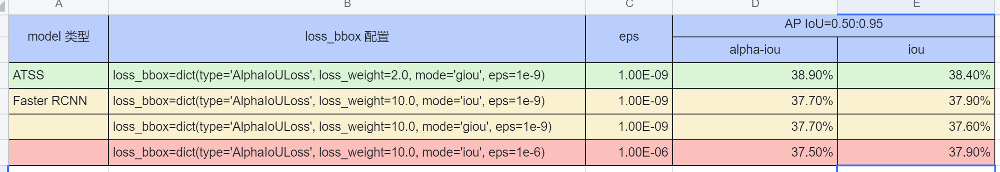

# AlphaIOU 实验记录
  

  
  
测试程序运行  
```bash
❯ python code/test.py
```
  
100 轮测试，每轮随机生成 1 ~ 20 个随机框 bboxes1 和 bboxes2  
生成框可视化如图（生成逻辑见代码不赘述了）

  
结果显示如下：  
```bash
❯ python code/test.py
# Tests IOU: 100
All tests equal: True
# Tests GIOU: 100
All tests equal: True
# Tests DIOU: 100
All tests equal: True
# Tests CIOU: 100
All tests equal: True
```
  
实验 log 参考  

| model name | config design | mAP |
| ---- | ---- | ---- |
| [faster_rcnn_r50_fpn_alphaiou_1x_coco](./records/logs/faster_rcnn_r50_fpn_alphaiou_1x_coco_eps1e-6.log) | alphaiou eps = 1e-6 | 37.5% |
| [faster_rcnn_r50_fpn_alphaiou_1x_coco](records/logs/faster_rcnn_r50_fpn_alphaiou_1x_coco_eps1e-9.log) | alphaiou eps = 1e-9 | 37.7% |
| [faster_rcnn_r50_fpn_alphagiou_1x_coco](records/logs/faster_rcnn_r50_fpn_alphagiou_1x_coco_eps1e-9.log) | alphagiou eps = 1e-9 | 37.7% |
| [atss_r50_fpn_alphaiou_1x_coco](records/logs/atss_r50_fpn_alphaiou_1x_coco_eps1e-9.log) | alphagiou eps = 1e-9 | 38.9% |
| [yolox_tiny_alphaiou_8x8_300e_coco](records/logs/yolox_tiny_alphaiou_8x8_300e_coco_eps1e-9.log) | alphaiou eps = 1e-9 | 31.6% |