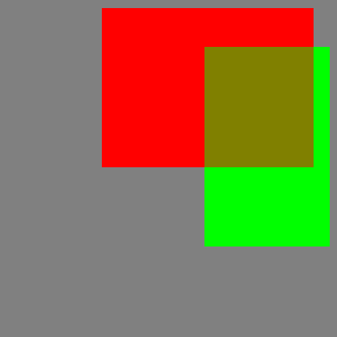

# AlphaIOU 实验记录
  

  
  
测试程序运行  
```bash
❯ python code/test.py
```
  
100 轮测试，每轮随机生成 1 ~ 20 个随机框 bboxes1 和 bboxes2  
生成框可视化如图（生成逻辑见代码不赘述了）

  
结果显示如下：  
```bash
❯ python code/test.py
# Tests IOU: 100
All tests equal: False
# Tests GIOU: 100
All tests equal: False
# Tests DIOU: 100
All tests equal: True
# Tests CIOU: 100
All tests equal: True
```
